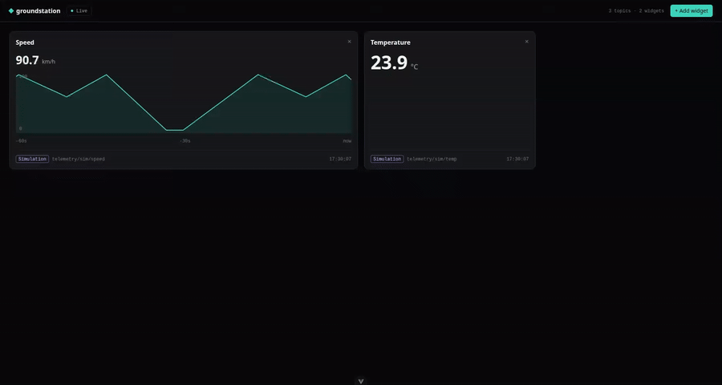
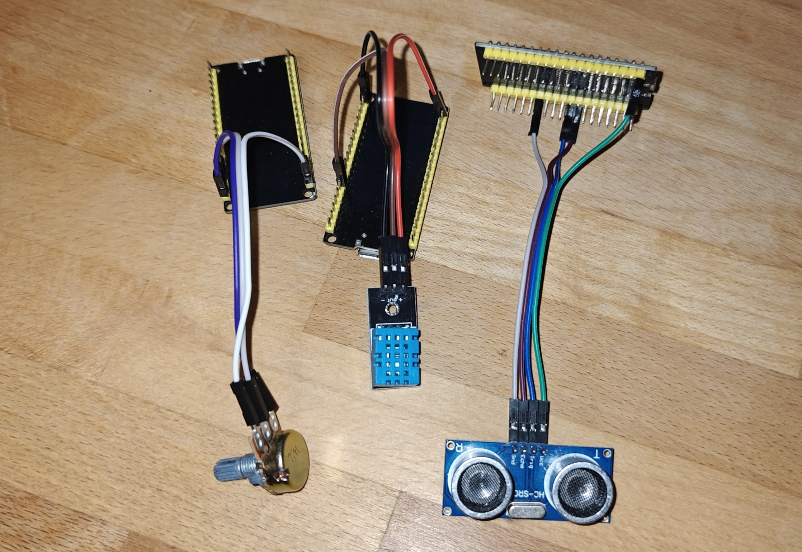
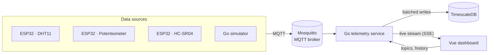
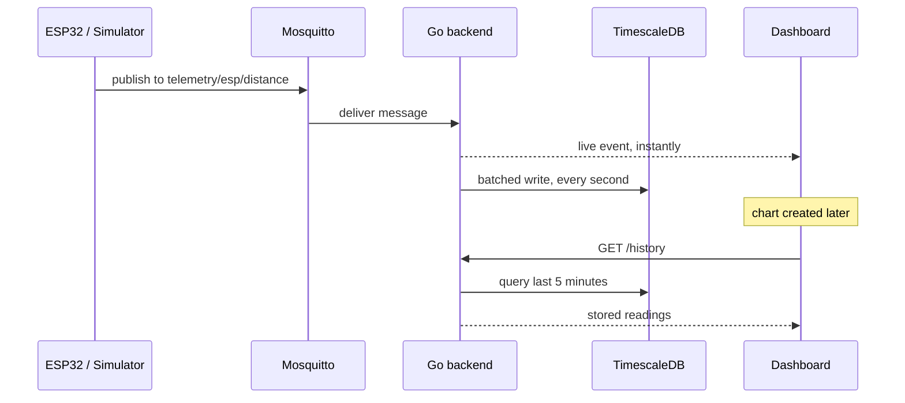

# groundstation

A self-hosted telemetry system: ESP32 sensors and simulators stream data over MQTT to a Go backend, which stores it in TimescaleDB and pushes it live to a web dashboard.



I built this to get more familiar with Go and combine it with my interests in embedded systems and live telemetry data.



## Features

- **Live dashboard** that updates the moment a sensor sends a new value
- **Widgets:** big number, gauge with editable range, line chart with a draggable time range
- **History:** readings are stored for 7 days, charts load recent data and continue live
- **ESP32 firmware** in C for a DHT11, a potentiometer and an HC-SR04 ultrasonic sensor
- **Simulator** in Go for working without hardware

## Architecture



### Life of a reading



## Design decisions

| Decision | Why |
|---|---|
| Topics defined in one JSON file | A new sensor shows up in the dashboard with one config entry, no code changes |
| Widgets declare which value types they support | New widgets are offered automatically for every matching topic |
| MQTT between devices and backend | Devices, simulators and backend can be restarted or replaced independently |
| Server-Sent Events instead of WebSockets | Data only flows one way, so the simpler protocol is enough |
| The live stream never waits for the database | A slow or offline database never freezes the dashboard |
| Batched writes with PostgreSQL's COPY | One bulk write per second instead of one insert per reading |
| Shared ESP-IDF component for Wi-Fi and MQTT | Each device project only contains its sensor code |

## Tech stack

| Layer | Technologies |
|---|---|
| Firmware | C, ESP-IDF, FreeRTOS |
| Messaging | MQTT, Eclipse Mosquitto |
| Backend | Go, Eclipse Paho, pgx |
| Database | PostgreSQL with TimescaleDB |
| Dashboard | Vue 3, TypeScript, Tailwind CSS |
| Infrastructure | Docker Compose |

## Project structure

| Folder | Contents |
|---|---|
| [`telemetry/`](telemetry/) | Go backend: MQTT subscriber, live stream, database writer, HTTP API |
| [`dashboard/`](dashboard/) | Vue dashboard |
| [`sim/`](sim/) | Go simulator |
| [`firmware/`](firmware/) | ESP32 firmware projects and their shared component |
| [`broker/`](broker/), [`database/`](database/) | Mosquitto configuration, database schema |

## Getting started

Requires Docker, Go and Node.js with pnpm.

```bash
cp .env.example .env                    # set a database password
docker compose up -d                    # broker and database

cd telemetry && go run .                # backend
cd sim && go run . -speed -temp -door   # simulator, in a second terminal
cd dashboard && pnpm install && pnpm dev   # dashboard, in a third terminal
```

Then open [http://localhost:5173](http://localhost:5173) and add a widget. For real hardware, see [`firmware/`](firmware/).